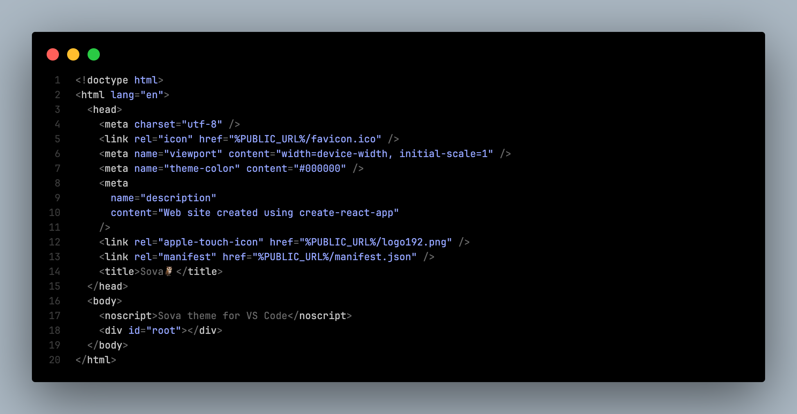
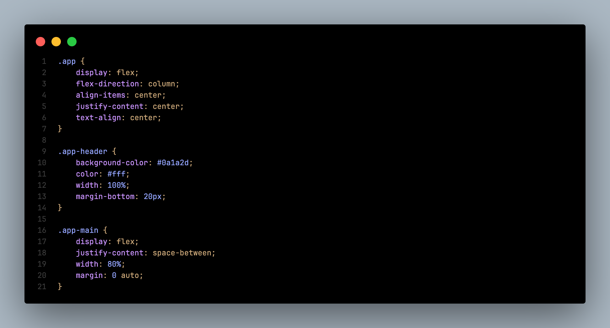
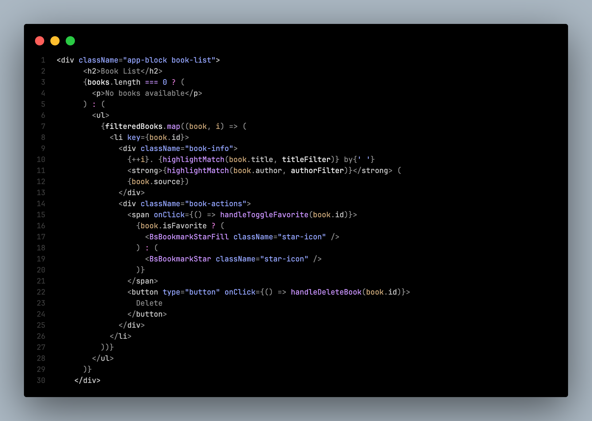

# Installation

1. Open **Extensions** sidebar panel in VS Code. `View → Extensions`
2. Search for **`Sova`**
3. Click **Install** to install it.
4. Code > Preferences > Color Theme > Select **Sova**

